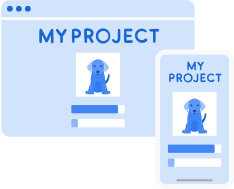

## Table of content
* [Introduction](#intro)
* [Try the model on local device](#local_device_instalion)
* [Try the model on google colab](#google_colab)
* [Resources](#ref)

## Introduction
This is an image classification model based on [Teachable Machine](https://teachablemachine.withgoogle.com/)

### What is Teachable Machine?

[Teachable Machine](https://teachablemachine.withgoogle.com/) is a web-based tool that makes creating machine learning models fast, easy, and accessible for everyone. [You can try it here](https://teachablemachine.withgoogle.com/).

### Who is it for?
Educators, artists, students, innovators, makers of all kinds – really, anyone who has an idea they want to explore. No prerequisite machine learning knowledge required.

### How does it work?
You train a computer to recognize your images, sounds, and poses without writing any machine learning code. Then, use your model in your own projects, sites, apps, and more.
### steps:

  

    

      <h4 class="numeral">https://github.com/Esraa772/AI-Projects
        1
       . Gather
      </h4>
      
      

        Gather and group your examples into classes, or categories, that you want the computer to learn.
      

      <a class="block-link" href="https://teachablemachine.withgoogle.com/train?action=onboardOpen&id=DFBbSTvtpy4">
        Video: Gather samples
      </a>
    

  

  

    

      <h4 class="numeral">
         2
       . Train
      </h4>
       
      

        Train your model, then instantly test it out to see whether it can correctly classify new examples.
      

      <a class="block-link" href="https://teachablemachine.withgoogle.com/train?action=onboardOpen&id=CO67EQ0ZWgA">
        Video: Train your model
      </a>
    

  

  

    

      <h4 class="numeral">
         3
       . Export
      </h4>
      
      
Export your model for your projects: sites, apps, and more. You can download your model or host it online for free.

      <a class="block-link" href="https://teachablemachine.withgoogle.com/train?action=onboardOpen&id=n-zeeRLBgd0">
        Video: Export your model
      </a>
    

  

